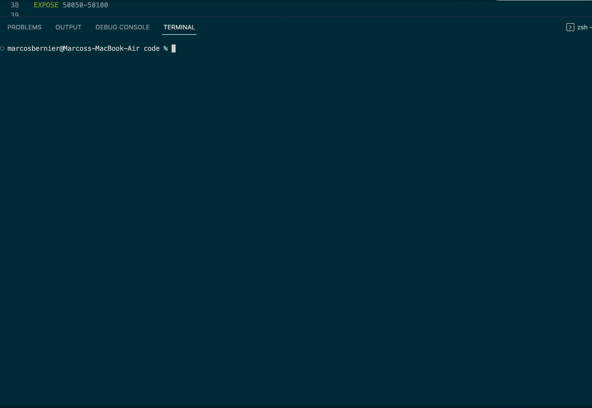
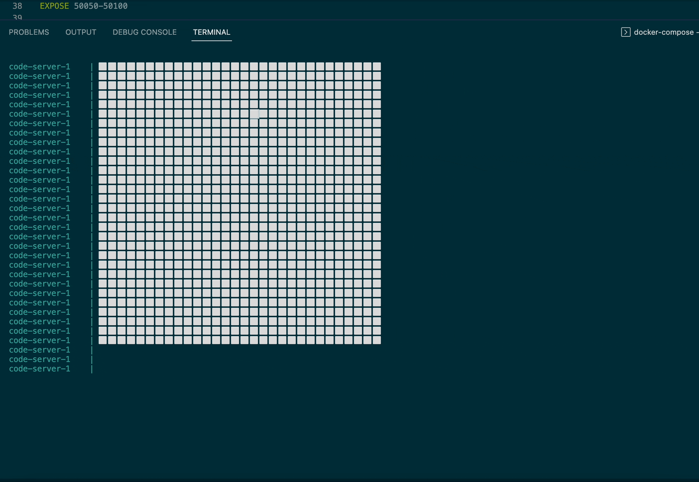

# Distributed Pokémon - CS 4113 Final Project

Program that creates instances of Pokemon, Trainers, and a singular Server to facilitate a pseudo-game in the image of the popular video game franchise Pokemon. Trainers and Pokemon populate an NxN map, and the Trainers subsequently try to capture the Pokemon, while the Pokemon try to run away from capturing Trainers. All of these moves are performed asynchronously, and the program is able to avoid conflicts by using threading locks; when an action is being performed on a space, that space is momentarily locked from being used by any other nodes while the current node is modifying it. This allows the safe execution of initial space assignment, moving, and Pokemon capturing. Capturing is also asynchronous-Trainers strive to move to a square occupied by a Pokemon, and if it identifies it has moved to an occupied square, it will request a capture - however, in the time between the move execution and the capture request, the Pokemon may have also moved away, so captures can frequently fail. Once a capture request goes through to the server, however, Pokemon are locked to the space until the capture is complete. They are then subsequently removed from the playing field.

## Code

This program consists of 3 script files, those being Pokemon.py, node.py, and Trainer.py.

* Pokemon.py - This script runs all of the logic related to the Pokemon entities. It consists of moving logic related to moving away from trainers on the map.

* Trainer.py - This script runs all of the logic related to the Trainer entities. It consists of moving logic related to moving towards Pokemon on the map, as well as logic related to the capture of Pokemon.

* node.py - This script runs all of the logic related to the Server entity. It consists of the gRPC server, as well as the path provided to client nodes to launch the Pokemon.py or Trainer.py scripts.

Additionally, the program contains two files related to the Docker service, those being Dockerfile and docker-compose.yml.

* Dockerfile - This file contains the instructions for building the Docker image. It is based on the Ubuntu 18.04 image, and installs the necessary dependencies for the program to run including Python 3.6, pip, and the gRPC Python library.

* docker-compose.yml - This file contains the instructions for running the Docker image. It contains the instructions for building the image, as well as the instructions for running the image. It defines the unique node qualifications of Trainer, Pokemon, and Server, and also defines the ports that the nodes will be exposed on.

Then, we have a file called requirements.txt, which would contain the dependencies for the program to run. This file is used by the Dockerfile to install the necessary dependencies. There are none included in this program.

Finally, we have a file named pokemon_ou.proto, which contains the protocol buffer definitions for the program. This file is used by the gRPC server to define the methods that the client nodes can call, and the parameters that they can pass to those methods. The program defines one unique service, the gameserver service.


## How to Run

* Number of Pokemon and Trainers Required = 22 

To run this program, you can use the docker-compose file provided. This will create a server, 22 trainers, and 22 pokemon. To run the program, simply run the following command:

```
docker-compose up --scale pokemon=22 --scale trainer=22
```

The --scale flag allows you to specify the number of pokemon and trainers you want to create. The default is 22, but you can change it to any number you want.

To specify the NxN size of the map, you can change the value of the environment variable MAP_SIZE in the Dockerfile file. The default is 20, but you can change it to any number you want (granted all nodes can fit on the board!)

From here, the game will execurte itself. All nodes will be created and assigned a space, and Pokemon nodes will get a small head start before the Trainers begin moving. The game will continue until all Pokemon are captured. Once all Pokemon are captured, the game will end and the server will print out the full move history of all nodes to ./path.txt and the final Pokedexes of all Trainers to ./pokedex.txt.

## Final Version


## First Version

### Compile


The program is compiled by passing the amount of trainers and pokemon as arguments to the docker compose command. The program is then compiled and the trainers and pokemon are initialized and given emojis in the next gif.

### Board Initialization



The program is now compiled and nodes begin to request connection and are assigned a name and a spot on the board if successful. Due to temporary timing delays the complete board assignment takes about 10-15 seconds but when the project is complete I will remove these delays. To avoid board conflicts, I use locks to ensure that an assignment can take place without another assignment at the same spot occuring at the same time.


## Development Schedule

I plan to use my weekends from now until the due date, 12/01, to complete this project. Specifically Saturdays and Sundays.

* Saturday 11/02 and Sunday 11/03: 4-5 hours combined 

This upcoming weekend, I intend to build out the general design of my distributed system. I will create my Dockerfile, my docker-compose file, and the protos.

* Saturday 11/09 and Sunday 11/10: 4-5 hours combined

This weekend, I will work on my general game design including the loop of the game, rules, and the general structure of the game "board". I'll also begin to work on the communicative aspects of the node.py file. (gRPC)

* Saturday 11/16 and Sunday 11/17: 4-5 hours combined

Hopefully by this weekend I'll be able to get a working version of the game running. I will refine the game logic and ensure that connectivity with all nodes is working as expected, as well as making sure that my initial design constraints made in the past couple of weekends were reasonable.

* Saturday 11/23 and Sunday 11/24: 2 hours

This weekend is optimally reserved for refinement and optimization of my project. I hope that I will have my project running correctly by this point but I will reserve this time in case I need to make any last minute changes.

* Saturday 11/30 and Sunday 12/01: 2 hours

Again, this time can be used for last minute changes and I will also begin to work on my presentation for the project. The submission is due on Sunday.

* Saturday 12/07 and Sunday 12/08: 2 hours

I will finish my presentation during this time and compose a script and general structure for how I will give it in class.

## Emoji Chooser

I preliminarily plan to use the following scheme for assigning emojis to trainers and pokemon:
For Pokemon, I will keep track of how many Pokemon have been previously introduced into the game, and I will use two arrays containing the CLDR shortcodes of every emoji mentioned in the project spec (https://emojipedia.org/nature/ and https://emojipedia.org/people/) in combination with the Python emoji module. I will use the count of how many pokemon have been introduced as an index for the next available shortcode to be used with the module's emoji.emojize() command. As for initializing the amount of trainers and pokemon, I intend to use the --scale argument that can be given when composing a docker file. For example, if I had a trainer service name and wanted to build 5 trainers, I would type docker-compose up --scale trainer=5. As for the NxN size of the board, I am aware that I am able to specify cmd line arguments in the Dockerfile and could easily manually type N in the file, but I am currently looking into a more convenient soltuion to this and the scaling situation.

## Interface

So far I only have created the functions that have been required of me in the project description.

### Server
Captured() will take an empty message and return feedback that indicates to a Pokemon that it has been captured.
Moves() will take an empty message and return a list of all moves that have been executed
Board() will take an empty message and return a graphical representation of the board

### Trainer

Capture() will take an empty message and return a message that indicates to the trainer that it has captured a Pokemon
Move() will take a message that contains the direction of the move and return a message that indicates to the trainer that it has moved
Path() will take an empty message and return a list of all moves that have been executed
Pokedex() will take an empty message and return a list of all Pokemon that have been captured
CheckBoard() will take an empty message and return a list of all possible moves

### Pokemon
CheckBoard() will take an empty message and return a list of all possible moves
Move() will take a message that contains the direction of the move and return a message that indicates to the Pokemon that it has moved
Path() will take an empty message and return a list of all moves that have been executed
Trainer() will take an empty message and return a message that explains the information about past capture and about the trainer holding it
